# Rapport de Comparaison des Modèles de Topics

**Généré le:** 2026-01-27 12:08:49

**Répertoire de sortie:** `results/comparisons/run_bigram_mpnet_iramuteq_spacy_large`

---

## Résumé

Ce rapport présente une comparaison approfondie de trois approches de modélisation de topics appliquées à un corpus de paroles de rap français : **BERTopic** (embeddings neuronaux), **LDA** (modèle génératif probabiliste), et **IRAMUTEQ** (classification lexicale par la méthode ALCESTE de Reinert). L'analyse se décompose comme suit :

1. **Description du corpus** : caractérisation statistique du corpus (nombre de documents, artistes, couverture temporelle, distribution par décennie).
2. **Description des modèles individuels** : paramètres, métriques de qualité (cohérence C_v, silhouette), distribution des topics et séparation des artistes pour chaque modèle.
3. **Q1 — Accord entre modèles** : évaluation de la similarité des clusterings à l'aide de l'ARI (Hubert & Arabie, 1985), la NMI (Strehl & Ghosh, 2002) et l'AMI (Vinh et al., 2010), avec analyse des correspondances inter-topics.
4. **Q2 — Séparation des artistes** : mesure de l'association artiste-topic par le V de Cramér (Cramér, 1946) et analyse des résidus de Pearson standardisés.
5. **Q3 — Dynamique temporelle** : analyse de la variance des distributions de topics dans le temps et de la divergence de Jensen-Shannon entre périodes biannuelles.
6. **Q4 — Distinctivité lexicale** : évaluation du chevauchement du vocabulaire entre topics par la distance de Jaccard et analyse inter-modèles.
7. **Q5 — Homogénéité intra-topic** : mesure de la cohérence lexicale des clusters par les distances de Labbé (Labbé & Labbé, 2001) et de Jensen-Shannon (Lin, 1991), calculées sur des documents tokenisés avec spaCy.
8. **Synthèse et recommandations** : bilan comparatif des trois modèles et recommandations d'usage.

---

## 1. Description du Corpus

Cette section présente une vue d'ensemble du corpus de paroles de rap français utilisé pour la modélisation de topics. Le corpus est constitué de couplets individuels extraits de chansons, avec des métadonnées incluant l'artiste, le titre et l'année.

### 1.1 Vue d'ensemble du jeu de données

| Métrique | Valeur |
|--------|-------|
| **Documents totaux (couplets)** | 115,785 |
| **Période couverte** | 1992 - 2023 |
| **Artistes uniques** | 605 |
| **Année moyenne** | 2014.7 |
| **Année médiane** | 2017 |
| **Docs moyens par artiste** | 191.4 |
| **Docs médians par artiste** | 137 |
| **Artiste le plus prolifique** | JuL (2,878 docs) |

### 1.2 Couverture Temporelle

Le corpus couvre plus de trois décennies de rap français, de l'ère pionnière des années 1990 à la scène contemporaine.

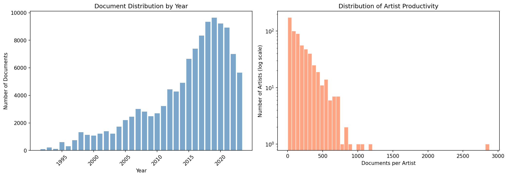

*Figure 1.1 : Gauche - Nombre de documents par année. Droite - Distribution de la productivité des artistes (échelle log).*

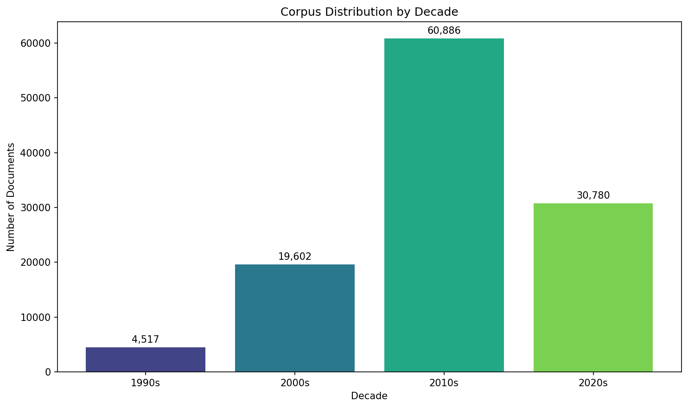

*Figure 1.2 : Distribution du corpus par décennie.*

| Décennie | Documents | % du Corpus |
|--------|-----------|-------------|
| 1990s | 4,517 | 3.9% |
| 2000s | 19,602 | 16.9% |
| 2010s | 60,886 | 52.6% |
| 2020s | 30,780 | 26.6% |

### 1.3 Top 10 Artistes par Nombre de Documents

| Rang | Artiste | Documents | % du Corpus | % Cumulatif |
|------|--------|-----------|-------------|--------------|
| 1 | JuL | 2,878 | 2.5% | 2.5% |
| 2 | La Fouine | 1,191 | 1.0% | 3.5% |
| 3 | Rohff | 1,094 | 0.9% | 4.5% |
| 4 | Sexion d’Assaut | 1,023 | 0.9% | 5.3% |
| 5 | Alkpote | 889 | 0.8% | 6.1% |
| 6 | Naps | 854 | 0.7% | 6.8% |
| 7 | Disiz | 849 | 0.7% | 7.6% |
| 8 | Swift Guad | 797 | 0.7% | 8.3% |
| 9 | IAM | 745 | 0.6% | 8.9% |
| 10 | Sinik | 744 | 0.6% | 9.6% |

**Concentration du corpus** : Les 10 premiers artistes représentent 9.6% du corpus, indiquant une distribution d'artistes diverse.

---

## 2. Description des Modèles Individuels

Cette section présente la configuration, les métriques de qualité et les topics découverts par chaque modèle. Nous incluons les visualisations spécifiques à chaque modèle pour contextualiser l'analyse comparative.

### 2.1 BERTopic

**Dossier du run:** `results/BERTopic/run_20260126_141647_mpnet`

BERTopic (Grootendorst, 2022) est un modèle de topics neuronal utilisant des embeddings de transformers pour la représentation des documents, UMAP pour la réduction de dimensionnalité, et le clustering. Les topics sont représentés via pondération c-TF-IDF, avec labellisation optionnelle par OpenAI et KeyBERT.

#### Paramètres

| Paramètre | Valeur |
|-----------|-------|
| embedding_model | `sentence-transformers/all-mpnet-base-v2` |
| embedding_key | `mpnet` |
| clustering_algorithm | `kmeans` |
| n_clusters | `20` |
| hdbscan_params | `None` |
| agglomerative_params | `None` |
| umap_params | n_neighbors=15, n_components=5, min_dist=0.0, metric=cosine, random_state=42 |
| num_words_per_topic | `30` |
| use_openai | `True` |
| include_keybert | `True` |
| interactive_html | `True` |

#### Qualité du Clustering

| Métrique | Valeur | Interprétation |
|--------|-------|----------------|
| Silhouette (UMAP) | 0.1717 | Modéré |

*Le score de silhouette (Rousseeuw, 1987) mesure la séparation des clusters.*

#### Distribution des Topics

| Métrique | Valeur | Interprétation |
|--------|-------|----------------|
| Nombre de topics | 20 | - |
| Ratio d'imbalance | 2.35 | Modérément équilibré |
| Entropie de distribution | 0.992 | Quasi uniforme |

**Définitions des métriques :**

- **Ratio d'imbalance** = max(compte_topic) / min(compte_topic). Mesure l'inégalité des tailles de topics.

- **Entropie de distribution** (normalisée) = -Σ(p_i × log(p_i)) / log(n_topics). Intervalle [0,1] : 1 = uniforme.

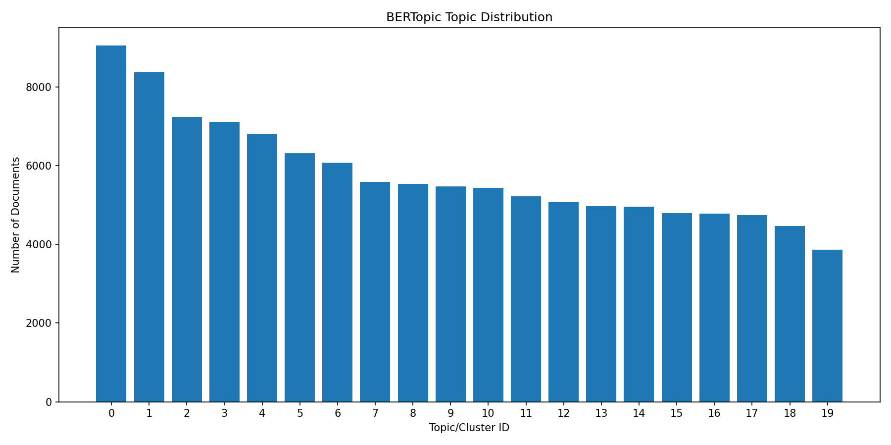

*Distribution des documents par topic.*

#### Séparation des Artistes

| Métrique | Valeur | Description |
|--------|-------|-------------|
| % Spécialistes | 2.2% | Artistes avec >50% dans un topic |
| % Modérés | 11.5% | Artistes avec 25-50% dans le topic dominant |
| % Généralistes | 86.3% | Artistes répartis sur plusieurs topics |
| Indice de spécialisation | 0.168 | Concentration moyenne |
| Divergence JS | 0.451 | Divergence des profils d'artistes |

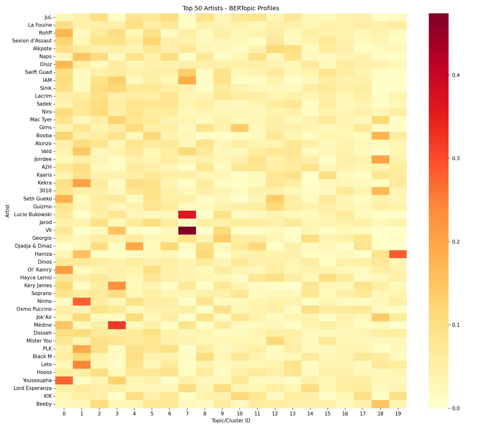

*Heatmap de distribution des artistes par topic.*

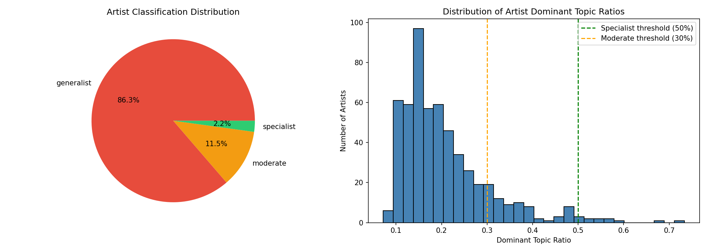

*Profils de spécialisation des artistes.*

#### Dynamique Temporelle

| Métrique | Valeur |
|--------|-------|
| Variance moyenne des topics | 0.000655 |
| JS biannuel moyen | 0.0803 |

**Transitions par décennie (divergence JS) :**

- 1990s->2000s: 0.0550 (Stable)
- 2000s->2010s: 0.1927 (Changement majeur)
- 2010s->2020s: 0.1809 (Changement majeur)

*Divergence JS entre périodes biannuelles.*

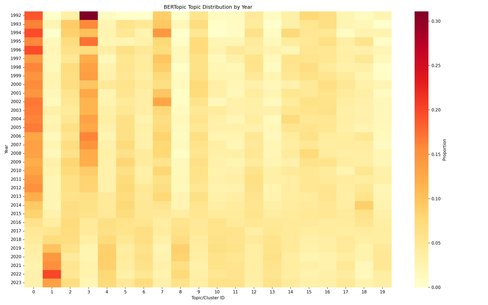

*Évolution des topics dans le temps.*

#### Vue d'ensemble des Topics

**Topic 0** — *Révolte et Identité dans le Rap*

- **c-TF-IDF:** de, le, les, est, la, pas, et, rap, un, on
- **KeyBERT (20 terms):** pas, ceux, ouais, rap, rappe, fait, comme, avec, monde, musique, vous, jamais, une, veux, que

**Topic 1** — *Pression Sociale et Ambitions Contradictoires*

- **c-TF-IDF:** ouais, la, oh, est, hey, yeah, pas, dans, le, on
- **KeyBERT (20 terms):** ouais, oui, pas, vous, fait, comme, pour, vois, jamais, avec, vie, tu, veux, une, sur

**Topic 2** — *Rébellion et Résilience dans la Rue*

- **c-TF-IDF:** les, la, le, de, on, pas, est, des, et, en
- **KeyBERT (20 terms):** pas, ouais, ceux, fait, vous, avec, comme, veux, monde, sur, jamais, vie, leur, une, pour

**Topic 3** — *Résistances et Réalités Urbaines*

- **c-TF-IDF:** de, la, les, le, est, et, on, des, un, pas
- **KeyBERT (20 terms):** pas, entre, leurs, fait, monde, ceux, avec, comme, une, sur, vous, veux, vie, france, leur

**Topic 4** — *Interrogations Existentielles et Solitude*

- **c-TF-IDF:** la, est, pas, on, dans, le, qu, tu, je, les
- **KeyBERT (20 terms):** pourquoi, que, pas, fait, ouais, avec, monde, mais, vie, sur, quoi, qui, peux, oui, jamais

**Topic 5** — *Réalité Crue et Résilience Urbaine*

- **c-TF-IDF:** les, la, le, de, est, pas, on, des, dans, et
- **KeyBERT (20 terms):** pas, ouais, vous, avec, fait, comme, monde, que, jamais, vie, une, sur, vois, veux, tu

**Topic 6** — *Résilience et Lutte pour la Vie*

- **c-TF-IDF:** la, pas, le, les, de, est, on, je, ai, tu
- **KeyBERT (20 terms):** pas, ouais, vous, fait, peux, avec, comme, vie, passe, veux, pour, monde, tu, une, vois

**Topic 7** — *Réflexions sur la Solitude et l'Injustice*

- **c-TF-IDF:** de, la, les, le, et, des, un, est, dans, en
- **KeyBERT (20 terms):** pas, fait, ceux, leurs, avec, entre, vie, comme, vous, monde, sur, une, veux, jour, homme

**Topic 8** — *Amour, Perte et Résilience Urbaine*

- **c-TF-IDF:** oh, la, pas, est, moi, je, ai, tu, ma, on
- **KeyBERT (20 terms):** ouais, pas, cœur, oui, peux, vie, avec, fait, laisse, vois, sur, comme, veux, mais, pour

**Topic 9** — *Desespoir et Lutte pour la Survivance*

- **c-TF-IDF:** de, la, le, les, est, et, je, que, un, on
- **KeyBERT (20 terms):** pas, cœur, fait, ceux, vie, comme, avec, monde, vous, sur, jour, une, pour, leur, veux

**Topic 10** — *Amours Perdue et Solitude Urbaine*

- **c-TF-IDF:** je, tu, pas, moi, est, que, ai, de, la, toi
- **KeyBERT (20 terms):** vie, comme, pas, laisse, cœur, fait, voir, ouais, pourquoi, avec, mais, moi, pour, peux, jour

**Topic 11** — *Chagrin et Résilience en Milieu Urbain*

- **c-TF-IDF:** la, pas, ai, est, je, de, tu, elle, le, qu
- **KeyBERT (20 terms):** pas, cœur, ouais, vie, vous, fait, peux, pour, avec, sur, tu, veux, mais, comme, jamais

**Topic 12** — *Réalité du Ghetto et Résilience*

- **c-TF-IDF:** la, de, les, le, est, dans, un, des, pas, on
- **KeyBERT (20 terms):** pas, ouais, avec, fait, comme, vie, vous, sur, veux, que, tu, monde, jamais, une, chez

**Topic 13** — *Rêves de Réussite et Réalité de la Rue*

- **c-TF-IDF:** la, pas, est, le, les, dans, suis, ai, on, de
- **KeyBERT (20 terms):** pas, vous, ouais, bon, peux, avec, vie, fait, comme, tu, veux, pour, que, connais, sur

**Topic 14** — *Amour, Trahison et Désillusion*

- **c-TF-IDF:** elle, je, de, est, que, la, amour, pas, et, qu
- **KeyBERT (20 terms):** pas, fait, vie, comme, avec, cœur, amour, pour, mais, fais, vois, jamais, tu, sur, jour

... et 5 autres topics

*Projection UMAP des embeddings colorés par topic.*

### 2.2 LDA

**Dossier du run:** `results/LDA/run_20260126_124051_bigram_only`

Latent Dirichlet Allocation (Blei, Ng & Jordan, 2003) est un modèle génératif probabiliste représentant les documents comme mélanges de topics, où chaque topic est une distribution sur les mots. Cette implémentation utilise Gensim avec prétraitement n-gram.

#### Paramètres

| Paramètre | Valeur |
|-----------|-------|
| num_topics | `20` |
| alpha | `symmetric` |
| eta | `auto` |
| passes | `15` |
| iterations | `400` |
| min_word_len | `2` |
| min_doc_freq | `5` |
| max_doc_freq_ratio | `0.3` |
| use_ngrams | `bigram_only` |
| ngram_min_count | `10` |
| ngram_threshold | `50` |
| num_words_per_topic | `30` |

#### Scores de Cohérence

| Métrique | Valeur | Interprétation |
|--------|-------|----------------|
| Cohérence C_v | 0.5883 | Bon |
| Cohérence UMass | -10.0216 | Modéré |

*La cohérence C_v (Röder et al., 2015) mesure la cohérence sémantique des mots des topics.*

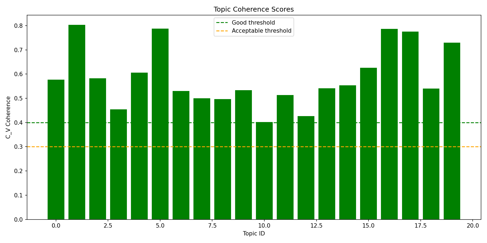

#### Distribution des Topics

| Métrique | Valeur | Interprétation |
|--------|-------|----------------|
| Nombre de topics | 20 | - |
| Ratio d'imbalance | 16.73 | Très déséquilibré |
| Entropie de distribution | 0.887 | Bien distribué |

**Définitions des métriques :**

- **Ratio d'imbalance** = max(compte_topic) / min(compte_topic). Mesure l'inégalité des tailles de topics.

- **Entropie de distribution** (normalisée) = -Σ(p_i × log(p_i)) / log(n_topics). Intervalle [0,1] : 1 = uniforme.

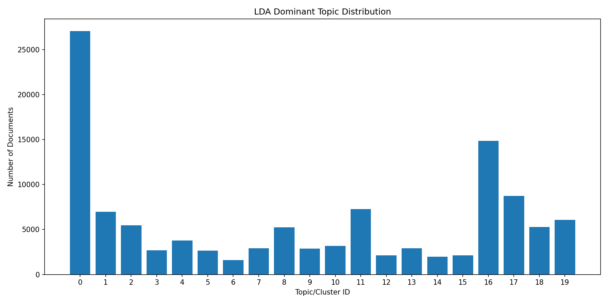

*Distribution des documents par topic.*

#### Séparation des Artistes

| Métrique | Valeur | Description |
|--------|-------|-------------|
| % Spécialistes | 0.5% | Artistes avec >50% dans un topic |
| % Modérés | 22.4% | Artistes avec 25-50% dans le topic dominant |
| % Généralistes | 77.0% | Artistes répartis sur plusieurs topics |
| Indice de spécialisation | 0.186 | Concentration moyenne |
| Divergence JS | 0.140 | Divergence des profils d'artistes |

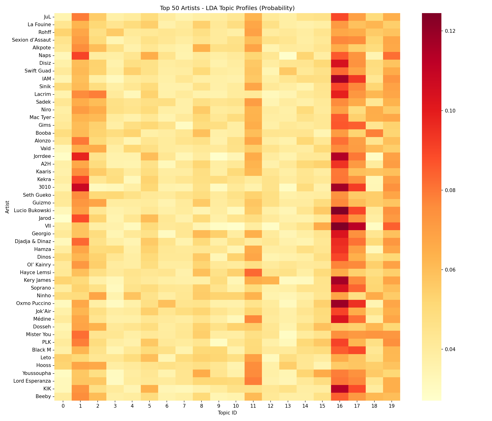

*Heatmap de distribution des artistes par topic.*

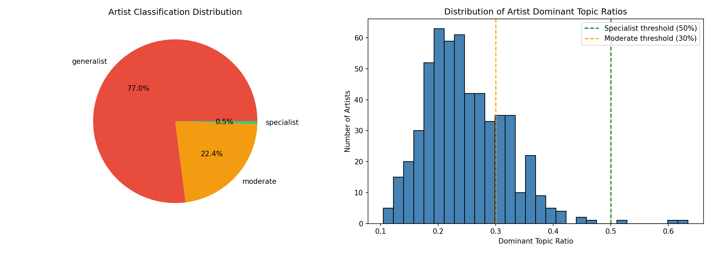

*Profils de spécialisation des artistes.*

#### Dynamique Temporelle

| Métrique | Valeur |
|--------|-------|
| Variance moyenne des topics | 0.000031 |
| JS biannuel moyen | 0.0270 |

**Transitions par décennie (divergence JS) :**

- 1990s->2000s: 0.0202 (Stable)
- 2000s->2010s: 0.0240 (Stable)
- 2010s->2020s: 0.0215 (Stable)

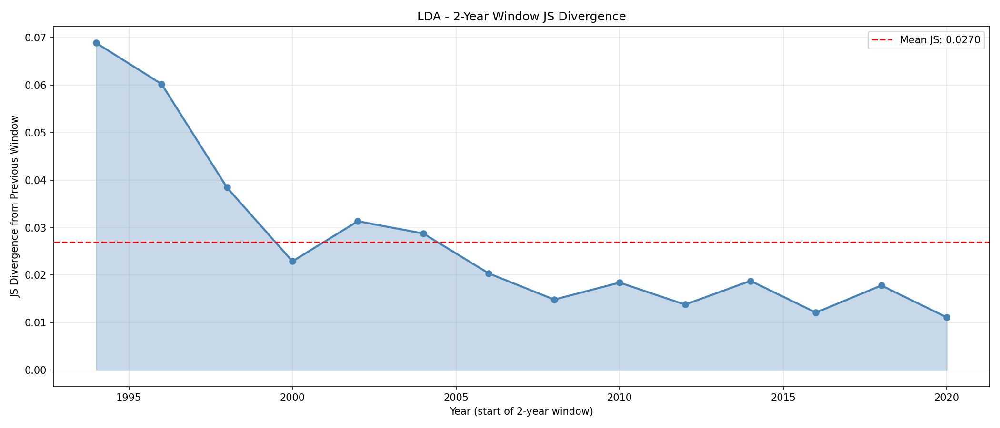

*Divergence JS entre périodes biannuelles.*

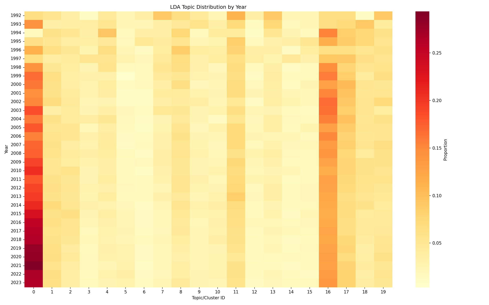

*Évolution des topics dans le temps.*

#### Vue d'ensemble des Topics

| Topic | Mots clés |
|-------|----------|
| 0 | coeur, bye_bye, savais, comptes, yeux_rouges, madame, voudrais, full, douce_france, satan |
| 1 | d'la, j'veux, merde, connais, putain, j'vais, gars, parle, j'me, négro |
| 2 | fils_pute, j'm'en_fous, j'en_marre, chaud_chaud, fils_putes, yeux_fermés, bord_mer, gucci, i'm, canon_scié |
| 3 | bat_couilles, semblant, quatre, briller, air_max, fumé, tient, grammes, nique, taff |
| 4 | j'y_pense, ailleurs, pense_qu'à, d'ma_mère, rend_fou, prie, aurait_pu, j'vous, po_po, sac_dos |
| 5 | m'a, vu, j'étais, j'me, j'peux, c'était, j'vais, j'avais, pris, père |
| 6 | sale, belle, famille, j'connais, étais, bonne, petite, danser, france, meilleur |
| 7 | comment, ouh, ciel, hip_hop, j'te_jure, étoiles, nulle_part, barre, montre, souvenirs |
| 8 | deux_trois, d'en_bas, ferme_yeux, jusqu'au_bout, tirer, l'impression_d'être, m'a_rendu, roue_tourne, j'rentre, s'il_plait |
| 9 | j'pense, m'as, bon, dix_ans, donné, t'aime, trouvé, bloc, voulais, rempli |
| 10 | bang_bang, p'tit, j'me_rappelle, tess, beuh, équipe, bienvenue, dalle, solo, paw_paw |
| 11 | j'me_sens, paroles_rédigées, j'aurais_pu, expliquées_communauté, qu'j'ai, terrain, rapgenius_france, disque_d'or, s'il_plaît, doigt |
| 12 | j'fais, demain, zone, ferme_gueule, mama, jours, fera, marseille, ira, nouveau |
| 13 | vas, t'inquiète, tourne_rond, années_passent, qu'tu_sois, souffrir, faits_divers, flammes, nord_sud, l'être_humain |
| 14 | j'aime, bébé, xxx, rentre, aura, lune, j'prends, paye, qu'j'suis, danse |

... et 5 autres topics

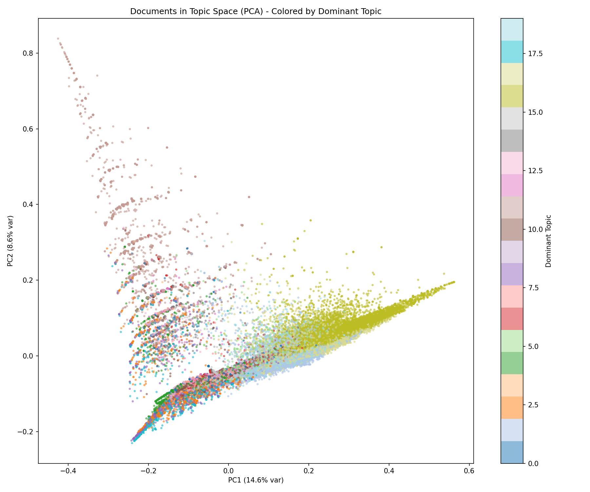

*Projection PCA des distributions topic-mot.*

### 2.3 IRAMUTEQ

**Dossier du run:** `results/IRAMUTEQ/evaluation_20260126_124001`

IRAMUTEQ implémente la méthode ALCESTE de Reinert (Reinert, 1983), qui effectue une classification hiérarchique descendante sur les segments de texte, identifiant les mondes lexicaux.

#### Paramètres

| Paramètre | Valeur |
|-----------|-------|
| method | `IRAMUTEQ` |
| n_classes | `20` |
| n_documents | `115805` |
| min_docs_per_artist | `10` |
| top_artists_per_topic | `20` |

#### Distribution des Topics

| Métrique | Valeur | Interprétation |
|--------|-------|----------------|
| Nombre de topics | 20 | - |
| Ratio d'imbalance | 31.70 | Très déséquilibré |
| Entropie de distribution | 2.709 | Quasi uniforme |

**Définitions des métriques :**

- **Ratio d'imbalance** = max(compte_topic) / min(compte_topic). Mesure l'inégalité des tailles de topics.

- **Entropie de distribution** (normalisée) = -Σ(p_i × log(p_i)) / log(n_topics). Intervalle [0,1] : 1 = uniforme.

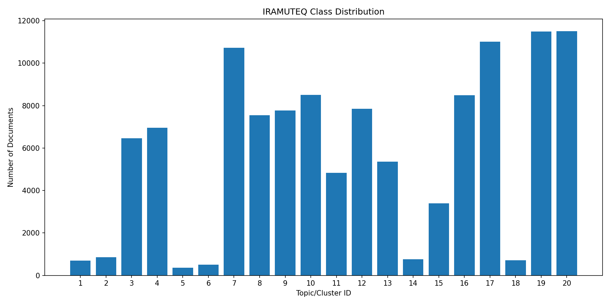

*Distribution des documents par topic.*

#### Séparation des Artistes

| Métrique | Valeur | Description |
|--------|-------|-------------|
| % Spécialistes | 12.2% | Artistes avec >50% dans un topic |
| % Modérés | 44.3% | Artistes avec 25-50% dans le topic dominant |
| % Généralistes | 43.4% | Artistes répartis sur plusieurs topics |
| Indice de spécialisation | 0.364 | Concentration moyenne |
| Divergence JS | 0.541 | Divergence des profils d'artistes |

*Heatmap de distribution des artistes par topic.*

*Profils de spécialisation des artistes.*

#### Dynamique Temporelle

| Métrique | Valeur |
|--------|-------|
| Variance moyenne des topics | 0.001857 |
| JS biannuel moyen | 0.1019 |

**Transitions par décennie (divergence JS) :**

- 1990s->2000s: 0.1787 (Changement majeur)
- 2000s->2010s: 0.3253 (Changement majeur)
- 2010s->2020s: 0.2147 (Changement majeur)

*Divergence JS entre périodes biannuelles.*

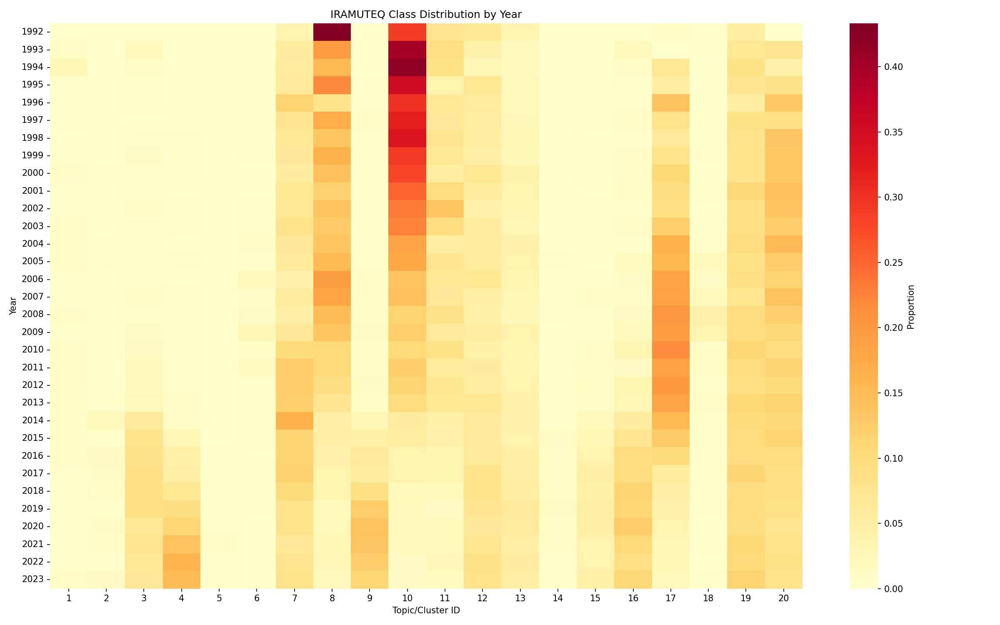

*Évolution des topics dans le temps.*

#### Vue d'ensemble des Topics

| Topic | Mots clés |
|-------|----------|
| 1 | with, and, that, when, they, you, it, can, the, like |
| 2 | chen, ekip, ldo, zuukou, etho, goddamn, nrm, digi, mms, lin |
| 3 | jul, marseille, gadji, moto, poto, fumette, bdh, zone, dégun, miss |
| 4 | hey, brr, yah, gucci, grr, gang, bébé, mmh, woh, fendi |
| 5 | luni, slimes, geeked, shawty, sacki, voidd, drip, majdon, ola, slime |
| 6 | sexion, wati, assaut, 9ème, gims, jeryzoos, akhi, maska, llefa, 3ème |
| 7 | bitch, négro, flow, meuf, club, weed, flex, boy, yo, dj |
| 8 | france, peuple, pays, politique, afrique, communauté, rédiger, justice, état, système |
| 9 | cli, ients, binks, détailler, midi, minuit, visser, gue, terrain, pe |
| 10 | mic, rime, rap, style, mc, hip_hop, rimer, beat, micro, texte |
| 11 | art, swift, acide, artère, guad, tekk, carcasse, delleck, corps, nikkfurie |
| 12 | chose, impression, penser, fois, temps, gens, question, moment, envie, vraiment |
| 13 | amour, aimer, sentiment, mentir, couple, amoureux, relation, femme, coeur, défaut |
| 14 | 2mz, qlf, sourou, igd, pnl, adios, amigo, benab, igo, rio |
| 15 | billet, violet, monnaie, vert, liasse, euro, poche, payer, charbonner, bleu |

... et 5 autres topics

---

## 3. Analyse Comparative

### 3.1 Q1 : Les modèles capturent-ils la même structure ?

**Question de recherche :** Les différentes approches découvrent-elles des structures similaires ?

#### Contexte Méthodologique

Nous utilisons trois métriques d'accord de clustering :

**Adjusted Rand Index (ARI)** — Hubert, L., & Arabie, P. (1985)

L'indice de Rand ajusté mesure la similarité entre deux clusterings,
corrigé par le hasard. Il calcule le nombre d'accords de paires (toutes deux dans le même cluster
ou toutes deux dans des clusters différents), normalisé par la valeur attendue sous un modèle aléatoire.
ARI = (RI - RI_attendu) / (RI_max - RI_attendu).
Intervalle : [-1, 1], où 1 = accord parfait, 0 = aléatoire, <0 = inférieur au hasard.

**Normalized Mutual Information (NMI)** — Strehl, A., & Ghosh, J. (2002)

La NMI mesure la dépendance mutuelle entre deux clusterings en utilisant la
théorie de l'information. Elle quantifie dans quelle mesure la connaissance d'un clustering réduit
l'incertitude sur l'autre. NMI = 2 × I(X;Y) / (H(X) + H(Y)), où I est l'information mutuelle et H l'entropie.
Intervalle : [0, 1], où 1 = clusterings identiques, 0 = indépendants.

#### Résultats

| Paire | ARI | NMI | Interprétation |
|------|-----|-----|----------------|
| bertopic_vs_lda | 0.0076 | 0.0149 | Quasi aléatoire |
| bertopic_vs_iramuteq | 0.0442 | 0.1024 | Accord faible |
| lda_vs_iramuteq | 0.0048 | 0.0150 | Quasi aléatoire |

**Observations clés :**

1. **Meilleur accord :** bertopic_vs_iramuteq (NMI = 0.1024)

2. **Accord le plus faible :** bertopic_vs_lda (NMI = 0.0149)

3. **Pattern général :** Les scores d'accord relativement faibles (NMI < 0.5) suggèrent que chaque modèle capture des aspects distincts :
- BERTopic : similarité sémantique (sens)
- LDA : co-occurrences de mots (distribution)
- IRAMUTEQ : classification lexicale (vocabulaire)

### 3.2 Q2 : Les modèles séparent-ils les artistes ?

**Question de recherche :** Les topics capturent-ils des signatures stylistiques propres aux artistes ?

#### Contexte Méthodologique

**V de Cramér** — Cramér, H. (1946)

Le V de Cramér mesure la force d'association entre deux variables catégorielles.
Il est dérivé de la statistique du chi-deux : V = √(χ² / (n × min(k-1, r-1))),
où k et r sont le nombre de catégories. V normalise le chi-deux par la taille de l'échantillon
et la dimensionnalité, permettant la comparaison entre tables de tailles différentes.
Intervalle : [0, 1], où 0 = aucune association, 1 = association parfaite.

#### Résultats

| Modèle | V de Cramér | Interprétation |
|-------|----------|----------------|
| BERTOPIC | 0.2079 | Association modérée |
| LDA | 0.1142 | Association faible |
| IRAMUTEQ | 0.3854 | Association forte |

**Observations clés :**

1. **Séparation la plus forte :** IRAMUTEQ (V = 0.3854)

2. **Spécialistes :** La proportion varie selon les modèles.

3. **Généralistes :** Artistes répartis sur plusieurs topics = thèmes divers.

### 3.3 Q3 : Les modèles capturent-ils l'évolution temporelle ?

**Question de recherche :** Les distributions de topics changent-elles dans le temps ?

#### Contexte Méthodologique

**Variance Temporelle** : Mesure la fluctuation des topics au fil du temps.

#### Résultats

| Modèle | Variance Temporelle | Topic le plus variable | Variance max | Interprétation |
|--------|-----|-----|-----|----------------|
| BERTOPIC | 0.000677 | 3 | 0.003566 | Stable |
| LDA | 0.000032 | 16 | 0.000091 | Stable |
| IRAMUTEQ | 0.001917 | 9 | 0.015929 | Dynamique modérée |

**JS Distance entre décennies :**

| Transition | BERTopic | LDA | IRAMUTEQ |
|------------|----------|-----|----------|
| 1990s->2000s | 0.0725 | 0.0320 | 0.1821 |
| 2000s->2010s | 0.1596 | 0.0237 | 0.2812 |
| 2010s->2020s | 0.2136 | 0.0248 | 0.2672 |

**Observations clés :**

1. **Le plus dynamique :** IRAMUTEQ montre la variance la plus élevée.

2. **Transitions majeures :** Une divergence JS élevée entre décennies indique des changements.

3. **Topics stables vs évolutifs :** Faible variance = thèmes pérennes, haute variance = tendances.

### 3.4 Q4 : Quelle est la distinctivité lexicale des topics ?

**Question de recherche :** Les topics représentent-ils des vocabulaires distincts ?

#### Contexte Méthodologique

**Distance de Jaccard** : Mesure la distinctivité du vocabulaire entre topics.

**Distinctivité** : Distance de Jaccard moyenne entre vocabulaires de topics.

#### Résultats

| Modèle | Distance de Jaccard Moyenne | Interprétation |
|--------|-----|----------------|
| BERTOPIC | 0.5062 | Chevauchement modéré |
| LDA | 0.9975 | Topics très distincts |
| IRAMUTEQ | 0.9964 | Topics très distincts |

**Observations clés :**

1. **LDA et IRAMUTEQ** montrent une haute distinctivité (>0.9).

2. **BERTopic** peut montrer une distinctivité plus faible (embeddings sémantiques).

#### Chevauchement Inter-Modèles (BERTopic vs LDA)

Comparaison du vocabulaire entre topics correspondants :

- **Similarité de Jaccard Moyenne** : 0.0027
- **Coefficient de Chevauchement Moyen** : 0.0054

Le faible chevauchement (0.3% Jaccard) suggère des caractérisations différentes.

| Topic BERTopic | Topic LDA | Jaccard | Mots communs |
|------|------|---------|------|
| 0 | 0 | 0.0000 | (aucun) |
| 1 | 0 | 0.0000 | (aucun) |
| 2 | 0 | 0.0000 | (aucun) |
| 3 | 0 | 0.0000 | (aucun) |
| 4 | 0 | 0.0000 | (aucun) |
| 5 | 0 | 0.0000 | (aucun) |
| 6 | 0 | 0.0000 | (aucun) |
| 7 | 16 | 0.0000 | (aucun) |
| 8 | 0 | 0.0000 | (aucun) |
| 9 | 16 | 0.0000 | (aucun) |
| 10 | 0 | 0.0000 | (aucun) |
| 11 | 0 | 0.0000 | (aucun) |
| 12 | 0 | 0.0000 | (aucun) |
| 13 | 0 | 0.0000 | (aucun) |
| 14 | 16 | 0.0179 | vois |
| 15 | 0 | 0.0000 | (aucun) |
| 16 | 0 | 0.0000 | (aucun) |
| 17 | 16 | 0.0357 | combien, vois |
| 18 | 0 | 0.0000 | (aucun) |
| 19 | 0 | 0.0000 | (aucun) |

### 3.5 Q5 : Quelle est l'homogénéité lexicale des topics ?

**Question de recherche :** Les documents d'un même topic sont-ils lexicalement similaires ?

Des distances intra-topic plus faibles indiquent des clusters plus cohérents.

#### Contexte Méthodologique

Nous calculons les distances par paires entre documents du même topic. Deux métriques complémentaires :

| Distance | Ce qu'elle capture | Justification scientifique |
|----------|------------------|--------------------------|
| **Jensen-Shannon** | Divergence distributionnelle | Largement utilisée en NLP. Fondée sur la théorie de l'information. Bornée [0,1]. |
| **Labbé** | Homogénéité lexicale | Standard JADT pour la stylométrie française. |

**Jensen-Shannon** — Lin, J. (1991)

La distance JS est la racine carrée de la divergence JS, une mesure
symétrique de similarité entre distributions de probabilité. scipy.spatial.distance.jensenshannon()
retourne directement cette valeur de distance. La distance JS est une métrique propre satisfaisant
l'inégalité triangulaire.
Intervalle : [0, 1], où 0 = distributions identiques, 1 = maximalement différentes.

**Labbé** — Labbé, D., & Labbé, C. (2001)

La distance de Labbé mesure la similarité lexicale entre deux textes à partir
des fréquences relatives des mots. Elle calcule la somme des différences absolues des fréquences :
D(A, B) = 0.5 × Σ|f_A(w) - f_B(w)|, où f_A(w) et f_B(w) sont les fréquences relatives du mot w.
Cette métrique est le standard en stylométrie française et dans la communauté JADT pour l'attribution
d'auteur et l'analyse textuelle. Elle capture l'homogénéité lexicale indépendamment du contenu sémantique.
Intervalle : [0, 1], où 0 = vocabulaires identiques, 1 = aucun chevauchement.

#### Résultats

**Distance Jensen-Shannon (Distributionnelle)**

| Modèle | Distance Moyenne | Écart-type | # Topics | Interprétation |
|-------|---------------|---------|----------|----------------|
| BERTOPIC | 0.8195 | 0.0031 | 20 | Très hétérogène |
| LDA | 0.8197 | 0.0027 | 20 | Très hétérogène |
| IRAMUTEQ | 0.8182 | 0.0081 | 20 | Très hétérogène |

**Distance de Labbé (Lexicale)**

| Modèle | Distance Moyenne | Écart-type | # Topics | Interprétation |
|-------|---------------|---------|----------|----------------|
| BERTOPIC | 0.9778 | 0.0049 | 20 | Très hétérogène |
| LDA | 0.9788 | 0.0053 | 20 | Très hétérogène |
| IRAMUTEQ | 0.9777 | 0.0129 | 20 | Très hétérogène |

**Observations clés :**

1. **Meilleure homogénéité distributionnelle (JS) :** IRAMUTEQ montre la distance moyenne la plus faible (0.8182).

2. **Meilleure homogénéité lexicale (Labbé) :** IRAMUTEQ montre la distance moyenne la plus faible (0.9777).

3. **Complémentarité :** JS capture la similarité distributionnelle, Labbé le chevauchement lexical absolu.

#### Analyse par Topic

Top 5 topics les plus et les moins homogènes (distance JS) :

**BERTOPIC**

*Topics les plus homogènes :*

| Topic | Distance JS Moyenne | # Documents |
|-------|------------------|-------------|
| 14 | 0.8112 | 4958 |
| 0 | 0.8142 | 9049 |
| 17 | 0.8157 | 4736 |
| 9 | 0.8166 | 5470 |
| 6 | 0.8175 | 6070 |

*Topics les moins homogènes :*

| Topic | Distance JS Moyenne | # Documents |
|-------|------------------|-------------|
| 3 | 0.8214 | 7098 |
| 10 | 0.8221 | 5434 |
| 4 | 0.8226 | 6798 |
| 8 | 0.8235 | 5528 |
| 7 | 0.8237 | 5585 |

**LDA**

*Topics les plus homogènes :*

| Topic | Distance JS Moyenne | # Documents |
|-------|------------------|-------------|
| 2 | 0.8144 | 5459 |
| 10 | 0.8158 | 3160 |
| 17 | 0.8165 | 8752 |
| 13 | 0.8175 | 2928 |
| 12 | 0.8176 | 2107 |

*Topics les moins homogènes :*

| Topic | Distance JS Moyenne | # Documents |
|-------|------------------|-------------|
| 7 | 0.8217 | 2924 |
| 19 | 0.8222 | 6060 |
| 1 | 0.8229 | 6958 |
| 0 | 0.8232 | 27066 |
| 5 | 0.8253 | 2669 |

**IRAMUTEQ**

*Topics les plus homogènes :*

| Topic | Distance JS Moyenne | # Documents |
|-------|------------------|-------------|
| 1 | 0.7920 | 702 |
| 18 | 0.8002 | 709 |
| 12 | 0.8139 | 7852 |
| 2 | 0.8145 | 850 |
| 5 | 0.8164 | 363 |

*Topics les moins homogènes :*

| Topic | Distance JS Moyenne | # Documents |
|-------|------------------|-------------|
| 6 | 0.8224 | 509 |
| 19 | 0.8230 | 11486 |
| 7 | 0.8239 | 10725 |
| 10 | 0.8248 | 8508 |
| 11 | 0.8255 | 4837 |

*Voir Annexe B pour une explication des métriques de distance.*

## 4. Synthèse et Conclusions

### Principales Conclusions

### Interprétation

1. **Perspectives Complémentaires :** Les trois modèles capturent des aspects différents :
   - **BERTopic** : similarité sémantique
   - **LDA** : co-occurrences de mots
   - **IRAMUTEQ** : mondes lexicaux

2. **Niveau d'Accord :** L'accord modéré à faible (NMI ~0.1-0.2) est attendu et informatif.

### Recommandations

- **Analyse sémantique :** Utilisez BERTopic
- **Analyse lexicale :** Utilisez LDA ou IRAMUTEQ

## 5. Références Méthodologiques

### Métriques d'Accord de Clustering

- Hubert, L., & Arabie, P. (1985). Comparing partitions. Journal of Classification, 2(1), 193-218.
- Strehl, A., & Ghosh, J. (2002). Cluster ensembles: A knowledge reuse framework. Journal of Machine Learning Research, 3, 583-617.
- Vinh, N. X., Epps, J., & Bailey, J. (2010). Information theoretic measures for clusterings comparison: Variants, properties, normalization and correction for chance. Journal of Machine Learning Research, 11, 2837-2854.

### Mesures d'Association

- Cramér, H. (1946). Mathematical Methods of Statistics. Princeton University Press.

### Théorie de l'Information

- Lin, J. (1991). Divergence measures based on the Shannon entropy. IEEE Transactions on Information Theory, 37(1), 145-151.

### Distance Intertextuelle

- Labbé, D., & Labbé, C. (2001). Inter-textual distance and authorship attribution. Corela : cognition, représentation, langage. Journal of Quantitative Linguistics, 8(3), 213-231.
- Labbé, D., & Monière, D. (2003). Le vocabulaire gouvernemental : Canada, Québec, France (1945-2000). Honoré Champion.
- Labbé, C., & Labbé, D. (2007). Experiments on authorship attribution by intertextual distance in English. Journal of Quantitative Linguistics, 14(1), 33-80.

### Cohérence des Topics

- Röder, M., Both, A., & Hinneburg, A. (2015). Exploring the space of topic coherence measures. In Proceedings of the Eighth ACM International Conference on Web Search and Data Mining (WSDM), 399-408.

### Validation de Clusters

- Rousseeuw, P. J. (1987). Silhouettes: A graphical aid to the interpretation and validation of cluster analysis. Journal of Computational and Applied Mathematics, 20, 53-65.

### Modélisation de Topics

- Grootendorst, M. (2022). BERTopic: Neural topic modeling with a class-based TF-IDF procedure. arXiv preprint arXiv:2203.05794.
- Blei, D. M., Ng, A. Y., & Jordan, M. I. (2003). Latent Dirichlet Allocation. Journal of Machine Learning Research, 3, 993-1022.
- Reinert, M. (1983). Une méthode de classification descendante hiérarchique : application à l'analyse lexicale par contexte. Les Cahiers de l'Analyse des Données, 8(2), 187-198.

## Annexes

### A. Détails des Runs

- **Timestamp de comparaison:** 2026-01-27 12:08:49
- **Dossier BERTopic:** results/BERTopic/run_20260126_141647_mpnet
- **Dossier LDA:** results/LDA/run_20260126_124051_bigram_only
- **Dossier IRAMUTEQ:** results/IRAMUTEQ/evaluation_20260126_124001

### ### B. Comparaison Mathématique : Labbé vs Jensen-Shannon

#### Labbé vs Jensen-Shannon : deux regards sur les fréquences

**Point commun**

Les deux métriques partent de la même représentation : chaque texte est une distribution
de probabilité sur le vocabulaire.

$$P_A = (f_1(A), f_2(A), \ldots, f_V(A)) \quad \text{où} \quad \sum_{i=1}^{V} f_i(A) = 1$$

---

#### Distance de Labbé

Mesure la différence absolue des fréquences :

$$D_{\text{Labbé}}(A, B) = \frac{1}{2} \sum_{i=1}^{V} |f_i(A) - f_i(B)|$$

C'est une **distance L1 (Manhattan) normalisée**.

---

#### Divergence de Jensen-Shannon

Mesure la divergence informationnelle entre les distributions.

$$D_{\text{JS}}(A, B) = \frac{1}{2} D_{\text{KL}}(P_A \| M) + \frac{1}{2} D_{\text{KL}}(P_B \| M)$$

où $M = (P_A + P_B) / 2$ est la distribution moyenne.

---

#### Différence fondamentale

| Aspect | Labbé | Jensen-Shannon |
|--------|-------|----------------|
| **Sensibilité** | Linéaire | Logarithmique |
| **Mots rares** | Faible impact | **Fort impact** |
| **Fondement** | Géométrique (L1) | Théorie de l'information |

---

#### Application au rap français

**JS est plus sensible aux mots d'argot spécifiques** à certains artistes/thèmes.
**Labbé capture mieux l'homogénéité globale** du vocabulaire courant.

**Recommandation :** Utiliser les deux métriques en complément :
- **Labbé** pour l'homogénéité lexicale générale
- **JS** pour détecter les vocabulaires distinctifs

